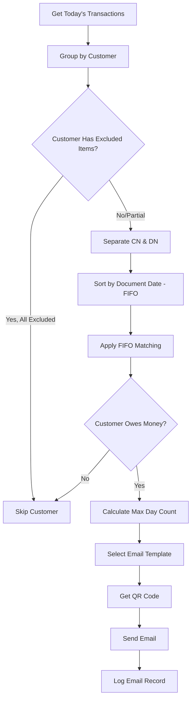

# Power Automate: Collections Email Engine

## Flow Overview

**Flow Name**: `Daily Collections Email Engine`
**Purpose**: Process transactions using FIFO logic and create email logs for payment reminders
**Trigger**: Scheduled (Mon-Fri, 07:30 SE Asia Time)
**Runtime**: ~15-30 minutes for 100 customers
**Dependencies**: Daily SAP Data Import flow must complete first

### Key Behaviors (Updated 2026-01-21)
| Behavior | Details |
|----------|---------|
| **Auto-Approve** | Creates EmailLog with ApprovalStatus = Approved (676180001) |
| **Exclusion** | Data filtered at Power BI source - excluded transactions never imported |
| **Template Selection** | D (MI docs) → C (Day 4+) → B (Day 3) → A (Day 1-2) |
| **Does NOT Send** | Only creates EmailLog records - Email Sending Flow handles actual send |

---

## Business Logic Summary

### Core Processing Flow



### FIFO Matching Algorithm

**Objective**: Determine if customer owes money after applying credits against debits in chronological order

> **IMPORTANT UPDATE (2026-01-14)**: The FIFO logic below has been superseded by the **STOP logic** clarified by the client. See `Flow_StepByStep_FIFO_EmailEngine.md` for the correct implementation.

**Client Clarification**: When applying CN in FIFO order, if the next CN would make total CN exceed total DN, **STOP completely**. Do NOT skip to check the next CN.

```javascript
// CORRECT Pseudocode (FIFO with STOP)
CN_List = Filter(Transactions, Amount < 0, IsExcluded = false)
DN_List = Filter(Transactions, Amount > 0, IsExcluded = false)

Sort(CN_List by DocumentDate ASC)  // FIFO - oldest first
Sort(DN_List by DocumentDate ASC)  // FIFO - oldest first

DN_Total = Sum(DN_List)  // Positive number
AppliedCN_Total = 0      // Running total (will be negative)

For each CN in CN_List (FIFO order):
    Potential_Total = Abs(AppliedCN_Total) + Abs(CN.Amount)

    If (Potential_Total <= DN_Total):
        AppliedCN_Total += CN.Amount  // Apply this CN
    Else:
        BREAK  // STOP - don't check remaining CNs

Remaining_Amount = DN_Total + AppliedCN_Total

if (DN_List.Count = 0) {
    // No bills to pay - skip customer
    Send = false
} else if (Remaining_Amount > 0) {
    // Customer owes money - send email
    Send = true
    AmountDue = Remaining_Amount
} else {
    // Credits covered all debits - skip customer
    Send = false
}
```

**See**: `Documentation/03-Power-Automate/Flow_StepByStep_FIFO_EmailEngine.md` for step-by-step implementation

---

## Flow Variables

### Initialize at Start

```json
{
  "varProcessDate": "@{formatDateTime(utcNow(), 'yyyy-MM-dd')}",
  "varProcessLogID": "",
  "varCustomerProcessed": 0,
  "varEmailsSent": 0,
  "varEmailsFailed": 0,
  "varErrorMessages": []
}
```

### Customer Processing Variables

```json
{
  "varCurrentCustomer": {},
  "varCustomerTransactions": [],
  "varCNList": [],
  "varDNList": [],
  "varCNTotal": 0,
  "varDNTotal": 0,
  "varNetAmount": 0,
  "varMaxDayCount": 0,
  "varEmailTemplate": "",
  "varTransactionsToSend": [],
  "varQRCodeFile": "",
  "varEmailSubject": "",
  "varEmailBody": ""
}
```

---

## Step-by-Step Implementation

### 1️⃣ **Trigger & Process Log**

#### Action: Recurrence (Optional)
```yaml
Type: Recurrence
Frequency: Day
Time: 08:30 AM  # After SAP import at 08:00 AM
Time Zone: SE Asia Standard Time
```

#### Action: Get Process Log
```yaml
Action: List rows (Dataverse)
Table: cr7bb_processlogs
Filter Query: |
  cr7bb_processdate eq '@{formatDateTime(utcNow(), 'yyyy-MM-dd')}'
  and cr7bb_status eq 'Completed'
Order by: cr7bb_endtime desc
Row count: 1
```

#### Validation: Import Completed
```yaml
Condition: length(outputs('Get_process_log')?['value']) equals 0
If True:
  - Send error notification: "SAP import not completed for today"
  - Terminate flow
```

---

### 2️⃣ **Get Today's Transactions**

#### Action: List rows (Dataverse)
```yaml
Table: cr7bb_transactions
Filter Query: |
  cr7bb_processdate eq '@{variables('varProcessDate')}'
  and cr7bb_recordtype eq 'Transaction'
  and cr7bb_emailsent eq false
Select columns: |
  cr7bb_transactionid,
  cr7bb_customer,
  cr7bb_documentnumber,
  cr7bb_documentdate,
  cr7bb_amountlocalcurrency,
  cr7bb_daycount,
  cr7bb_isexcluded,
  cr7bb_transactiontype
Row count: 5000
```

#### Action: Group by Customer
```javascript
// Use "Select" action to extract unique customer IDs
outputs('List_transactions')?['value']
// Then use "Filter array" for each customer
```

---

### 3️⃣ **For Each Customer - Main Processing Loop**

#### Action: Apply to each
```yaml
Select output: @{body('Get_unique_customers')}
Concurrency: 1  # Sequential processing for accurate logging
```

#### Get Customer Record
```yaml
Action: Get a row by ID (Dataverse)
Table: cr7bb_customers
Row ID: @{item()}
```

#### Get Customer Transactions
```yaml
Action: Filter array
From: @{outputs('List_transactions')?['value']}
Where: _cr7bb_customer_value eq @{item()}
```

---

### 4️⃣ **Exclusion Check**

#### Check All Transactions Excluded
```javascript
// Condition expression
equals(
  length(
    filter(
      outputs('Get_customer_transactions'),
      equals(item()?['cr7bb_isexcluded'], false)
    )
  ),
  0
)
```

#### If All Excluded
```yaml
Actions:
  - Append to varErrorMessages: "Customer @{outputs('Get_customer')?['cr7bb_customercode']} - All transactions excluded"
  - Continue to next customer
```

---

### 5️⃣ **FIFO Processing**

#### Separate CN and DN
```javascript
// CN List (Credit Notes - negative amounts)
filter(
  outputs('Get_customer_transactions'),
  and(
    less(item()?['cr7bb_amountlocalcurrency'], 0),
    equals(item()?['cr7bb_isexcluded'], false)
  )
)

// DN List (Debit Notes - positive amounts)
filter(
  outputs('Get_customer_transactions'),
  and(
    greater(item()?['cr7bb_amountlocalcurrency'], 0),
    equals(item()?['cr7bb_isexcluded'], false)
  )
)
```

#### Sort by Document Date (FIFO)
```javascript
// Sort CN list
sort(
  outputs('CN_list'),
  'cr7bb_documentdate'
)

// Sort DN list
sort(
  outputs('DN_list'),
  'cr7bb_documentdate'
)
```

#### Calculate Totals
```javascript
// CN Total (will be negative)
sum(outputs('CN_sorted'), 'cr7bb_amountlocalcurrency')

// DN Total (will be positive)
sum(outputs('DN_sorted'), 'cr7bb_amountlocalcurrency')

// Net Amount
add(
  variables('varDNTotal'),
  variables('varCNTotal')
)
```

---

### 6️⃣ **Send Decision Logic**

#### Condition: Should Send Email?
```javascript
and(
  greater(length(outputs('DN_sorted')), 0),  // Has DN transactions
  greater(variables('varNetAmount'), 0)       // Customer owes money
)
```

#### If No Send
```yaml
Actions:
  - Append to varErrorMessages: "Customer @{outputs('Get_customer')?['cr7bb_customercode']} - No amount due (CN >= DN)"
  - Continue to next customer
```

---

### 7️⃣ **Calculate Max Day Count**

#### Get Maximum Day Count
```javascript
// From DN transactions only (bills being paid)
max(
  map(
    outputs('DN_sorted'),
    item()?['cr7bb_daycount']
  )
)
```

#### Store in Variable
```yaml
Action: Set variable
Name: varMaxDayCount
Value: @{outputs('Calculate_max_daycount')}
```

---

### 8️⃣ **Email Template Selection**

#### Determine Template
```javascript
// Expression
if(
  lessOrEquals(variables('varMaxDayCount'), 2),
  'Template_A',  // Day 1-2: Standard
  if(
    equals(variables('varMaxDayCount'), 3),
    'Template_B',  // Day 3: Cash discount warning
    'Template_C'   // Day 4+: Late fees
  )
)

// Check for MI documents
if(
  greater(
    length(
      filter(
        outputs('DN_sorted'),
        contains(item()?['cr7bb_documenttype'], 'MI')
      )
    ),
    0
  ),
  'Template_D',  // MI explanation
  variables('varEmailTemplate')
)
```

---

### 9️⃣ **Build Email Content**

#### Compose Email Subject
```javascript
concat(
  outputs('Get_customer')?['cr7bb_customercode'],
  ', ',
  outputs('Get_customer')?['cr7bb_customername'],
  ', รายละเอียดบิลวันที่ ',
  formatDateTime(
    min(map(outputs('DN_sorted'), item()?['cr7bb_documentdate'])),
    'dd/MM/yyyy'
  ),
  ' - ',
  formatDateTime(
    max(map(outputs('DN_sorted'), item()?['cr7bb_documentdate'])),
    'dd/MM/yyyy'
  )
)
```

#### Compose Email Body (HTML)

**Template A (Day 1-2 - Standard)**
```html
<html>
<body style="font-family: Arial, sans-serif;">
  <p>เรียน คุณ @{outputs('Get_customer')?['cr7bb_customername']}</p>

  <p>ตามที่บริษัทได้ตรวจสอบยอดค้างชำระพบว่า ณ วันที่ @{formatDateTime(utcNow(), 'dd/MM/yyyy')} ท่านมียอดค้างชำระดังนี้</p>

  <table border="1" cellpadding="5" style="border-collapse: collapse;">
    <tr style="background-color: #0078D4; color: white;">
      <th>เลขที่เอกสาร</th>
      <th>วันที่เอกสาร</th>
      <th>วันครบกำหนด</th>
      <th>จำนวนวันค้าง</th>
      <th>จำนวนเงิน (THB)</th>
    </tr>
    @{body('Build_transaction_rows')}
  </table>

  <p><strong>รวมยอดค้างชำระทั้งสิ้น: @{formatNumber(variables('varNetAmount'), 'N2')} บาท</strong></p>

  <p>กรุณาชำระเงินผ่าน PromptPay QR Code ที่แนบมาพร้อมนี้</p>

  <p>ขอบคุณค่ะ</p>

  <p>
    @{outputs('Get_AR_representative')?['displayName']}<br/>
    Accounts Receivable - @{outputs('Get_customer')?['cr7bb_region']}<br/>
    Email: @{outputs('Get_AR_representative')?['mail']}<br/>
    Tel: @{outputs('Get_AR_representative')?['businessPhones'][0]}
  </p>
</body>
</html>
```

**Template B (Day 3 - Warning)**
```html
<!-- Same as Template A, plus: -->
<p style="color: #D83B01; font-weight: bold;">
  ⚠️ หมายเหตุ: หากไม่ชำระภายในวันที่ @{formatDateTime(addDays(utcNow(), 1), 'dd/MM/yyyy')}
  ท่านจะสูญเสียสิทธิ์ส่วนลด Cash Discount
</p>
```

**Template C (Day 4+ - Late Fees)**
```html
<!-- Same as Template A, plus: -->
<p style="color: #A4262C; font-weight: bold;">
  ⚠️ การชำระล่าช้า: ท่านจะถูกเรียกเก็บค่า MI (ดอกเบี้ยเงินเฟ้อจากการชำระล่าช้า)
  กรุณาติดต่อ AR ทันที
</p>
```

**Template D (MI Documents)**
```html
<!-- Same as Template A, plus: -->
<p style="background-color: #FFF4CE; padding: 10px; border-left: 4px solid #F7630C;">
  <strong>MI คืออะไร?</strong><br/>
  MI (Market Interest) คือค่าธรรมเนียมดอกเบี้ยเงินเฟ้อที่เกิดจากการชำระเงินล่าช้า
  ซึ่งจะถูกคำนวณอัตโนมัติตามจำนวนวันที่ค้างชำระ
</p>
```

#### Build Transaction Table Rows
```javascript
// Use "Select" action to create HTML rows
concat(
  '<tr>',
  '<td>', item()?['cr7bb_documentnumber'], '</td>',
  '<td>', formatDateTime(item()?['cr7bb_documentdate'], 'dd/MM/yyyy'), '</td>',
  '<td>', formatDateTime(item()?['cr7bb_netduedate'], 'dd/MM/yyyy'), '</td>',
  '<td style="text-align: center;">', item()?['cr7bb_daycount'], '</td>',
  '<td style="text-align: right;">', formatNumber(item()?['cr7bb_amountlocalcurrency'], 'N2'), '</td>',
  '</tr>'
)

// Then join all rows
join(outputs('Build_rows'), '')
```

---

### 🔟 **Get QR Code File**

#### Action: Get file metadata (SharePoint)
```yaml
Site Address: [SharePoint Site URL]
Library: QR Codes
File Path: /QR Codes/@{outputs('Get_customer')?['cr7bb_customercode']}.png
```

#### Handle Missing QR Code
```yaml
Configure run after: has failed
Action: Set variable
Name: varQRCodeFile
Value: null

Action: Append to varErrorMessages
Value: "Customer @{outputs('Get_customer')?['cr7bb_customercode']} - QR code file missing"
```

---

### 1️⃣1️⃣ **Get AR Representative Signature**

#### Action: Get user profile (Office 365 Users)
```yaml
User (UPN): @{outputs('Get_customer')?['cr7bb_arbackupemail1']}
```

#### Fallback to Default
```yaml
Configure run after: has failed
Action: Get user profile (Office 365 Users)
User (UPN): ar-default@nestle.com
```

---

### 1️⃣2️⃣ **Send Email**

#### Build Recipient List
```javascript
// Primary recipients (filter out empty emails)
filter(
  [
    outputs('Get_customer')?['cr7bb_customeremail1'],
    outputs('Get_customer')?['cr7bb_customeremail2'],
    outputs('Get_customer')?['cr7bb_customeremail3'],
    outputs('Get_customer')?['cr7bb_customeremail4']
  ],
  not(empty(item()))
)
// Join with semicolon
join(outputs('Filter_customer_emails'), '; ')
```

#### Build CC List
```javascript
// Sales + AR backup emails
filter(
  [
    outputs('Get_customer')?['cr7bb_salesemail1'],
    outputs('Get_customer')?['cr7bb_salesemail2'],
    outputs('Get_customer')?['cr7bb_salesemail3'],
    outputs('Get_customer')?['cr7bb_salesemail4'],
    outputs('Get_customer')?['cr7bb_salesemail5'],
    outputs('Get_customer')?['cr7bb_arbackupemail1'],
    outputs('Get_customer')?['cr7bb_arbackupemail2'],
    outputs('Get_customer')?['cr7bb_arbackupemail3'],
    outputs('Get_customer')?['cr7bb_arbackupemail4']
  ],
  not(empty(item()))
)
// Join with semicolon
join(outputs('Filter_cc_emails'), '; ')
```

#### Action: Send an email (V2) with Attachments
```yaml
To: @{variables('varRecipientEmails')}
CC: @{variables('varCCEmails')}
Subject: @{variables('varEmailSubject')}
Body: @{variables('varEmailBody')}
Attachments:
  - Name: "@{outputs('Get_customer')?['cr7bb_customercode']}_QRCode.png"
    ContentBytes: @{body('Get_QR_code')?['$content']}
Importance: High (if maxDayCount >= 3)
```

#### Error Handling
```yaml
Configure run after: has failed or has timed out
Actions:
  - Increment varEmailsFailed
  - Append to varErrorMessages: "Email failed for @{outputs('Get_customer')?['cr7bb_customercode']}: @{outputs('Send_email')?['error']?['message']}"
  - Continue to next customer
```

---

### 1️⃣3️⃣ **Log Email Record**

#### Action: Add a new row (Dataverse)
```yaml
Table: cr7bb_emaillogs
Fields:
  cr7bb_customer@odata.bind: "/cr7bb_customers(@{outputs('Get_customer')?['cr7bb_customerid']})"
  cr7bb_processdate: "@{variables('varProcessDate')}"
  cr7bb_emailsubject: "@{variables('varEmailSubject')}"
  cr7bb_emailbodypreview: "@{variables('varEmailBody')}"
  cr7bb_emailtemplate: "@{variables('varEmailTemplate')}"
  cr7bb_maxdaycount: "@{variables('varMaxDayCount')}"
  cr7bb_totalamount: "@{variables('varNetAmount')}"
  cr7bb_transactioncount: "@{length(outputs('DN_sorted'))}"
  cr7bb_recipientemails: "@{variables('varRecipientEmails')}"
  cr7bb_ccemails: "@{variables('varCCEmails')}"
  cr7bb_approvalstatus: 676180001     # Approved (AUTO-APPROVED)
  cr7bb_sendstatus: 676180002         # Pending (waiting for Email Sending Flow)
  cr7bb_qrcodeincluded: "@{not(empty(variables('varQRCodeFile')))}"
```

**Important**: This flow does NOT send emails. It only creates EmailLog records with:
- `ApprovalStatus = Approved (676180001)` - Auto-approved, no manual approval needed
- `SendStatus = Pending (676180002)` - Waiting for Email Sending Flow at 08:00

---

### 1️⃣4️⃣ **Update Transaction Records**

#### Action: Apply to each (DN Transactions)
```yaml
From: @{outputs('DN_sorted')}
```

#### Update Transaction
```yaml
Action: Update a row (Dataverse)
Table: cr7bb_transactions
Row ID: @{item()?['cr7bb_transactionid']}
Fields:
  cr7bb_emailsent: true
  cr7bb_isprocessed: true
```

---

### 1️⃣5️⃣ **Final Summary & Notification**

#### Update Process Log
```yaml
Action: Update a row (Dataverse)
Table: cr7bb_processlogs
Row ID: @{outputs('Get_process_log')?['value']?[0]?['cr7bb_processlogid']}
Fields:
  cr7bb_emailssent: "@{variables('varEmailsSent')}"
  cr7bb_emailsfailed: "@{variables('varEmailsFailed')}"
```

#### Send Summary Email to AR Team
```yaml
Action: Send an email (V2)
To: ar-team@nestle.com
Subject: "Collections Email Summary - @{formatDateTime(utcNow(), 'dd/MM/yyyy')} - @{if(greater(variables('varEmailsFailed'), 0), '⚠️ Completed with Errors', '✅ Success')}"
Body: |
  <h2>Daily Collections Email Summary</h2>

  <h3>Statistics</h3>
  <ul>
    <li>Process Date: @{formatDateTime(variables('varProcessDate'), 'dd/MM/yyyy HH:mm')}</li>
    <li>Customers Processed: @{variables('varCustomerProcessed')}</li>
    <li>Emails Sent Successfully: @{variables('varEmailsSent')}</li>
    <li>Emails Failed: @{variables('varEmailsFailed')}</li>
  </ul>

  @{if(greater(variables('varEmailsFailed'), 0),
    concat(
      '<h3>⚠️ Errors</h3><ul>',
      join(map(variables('varErrorMessages'), concat('<li>', item(), '</li>')), ''),
      '</ul>'
    ),
    ''
  )}

  <p><a href="https://make.powerapps.com">View Details in Power Apps</a></p>
Importance: @{if(greater(variables('varEmailsFailed'), 0), 'High', 'Normal')}
```

---

## Power Automate Expression Examples

### FIFO Sorting
```javascript
// Sort by document date ascending (FIFO)
sort(
  outputs('Transaction_list'),
  'cr7bb_documentdate'
)
```

### Array Filtering
```javascript
// Get non-excluded transactions
filter(
  outputs('All_transactions'),
  equals(item()?['cr7bb_isexcluded'], false)
)

// Get DN only (positive amounts)
filter(
  outputs('All_transactions'),
  greater(item()?['cr7bb_amountlocalcurrency'], 0)
)

// Get CN only (negative amounts)
filter(
  outputs('All_transactions'),
  less(item()?['cr7bb_amountlocalcurrency'], 0)
)
```

### Aggregations
```javascript
// Sum amounts
sum(
  outputs('Transaction_list'),
  'cr7bb_amountlocalcurrency'
)

// Max day count
max(
  map(
    outputs('Transaction_list'),
    item()?['cr7bb_daycount']
  )
)

// Min/Max dates
min(map(outputs('Transaction_list'), item()?['cr7bb_documentdate']))
max(map(outputs('Transaction_list'), item()?['cr7bb_documentdate']))
```

### Email Address Handling
```javascript
// Filter out empty emails
filter(
  [
    outputs('Customer')?['cr7bb_customeremail1'],
    outputs('Customer')?['cr7bb_customeremail2'],
    outputs('Customer')?['cr7bb_customeremail3'],
    outputs('Customer')?['cr7bb_customeremail4']
  ],
  not(empty(item()))
)

// Join with semicolon
join(outputs('Filtered_emails'), '; ')
```

---

## Error Handling Strategy

### Scope: Try-Catch Pattern
```yaml
Scope: Try_Email_Processing
  - All email generation and sending

Scope: Catch_Email_Errors
  Configure run after: has failed
  Actions:
    - Log error to email log with Failed status
    - Increment error counter
    - Continue to next customer (don't terminate flow)
```

### Retry Policies
```yaml
Send Email Action:
  Retry Policy:
    Type: Exponential
    Count: 3
    Interval: PT30S  # 30 seconds
    Max Interval: PT5M  # 5 minutes

Get QR Code:
  Retry Policy:
    Type: Fixed
    Count: 2
    Interval: PT10S
```

---

## Testing Procedure

### 1. Single Customer Test
**Test Data**: Customer with 2 DN, 1 CN, net positive
**Expected**: Email sent with correct FIFO calculation

### 2. Template Selection Test
| Max Day Count | Expected Template |
|--------------|-------------------|
| 1 | Template A |
| 2 | Template A |
| 3 | Template B |
| 4 | Template C |
| Contains MI | Template D |

### 3. Exclusion Test
**Test Data**: All transactions excluded
**Expected**: Skip customer, no email sent

### 4. CN Exceeds DN Test
**Test Data**: CN total > DN total
**Expected**: Skip customer (no amount due)

### 5. Missing QR Code Test
**Test Data**: Customer with no QR code file
**Expected**: Email sent without attachment, warning logged

### 6. Email Failure Test
**Test Data**: Invalid email address
**Expected**: Error logged, processing continues

---

## Performance Optimization

### Customer Lookup Caching
```yaml
Before Main Loop:
  Action: List all active customers
  Store in: varCustomerCache

In Loop:
  Use cached data instead of individual lookups
```

### Transaction Grouping
```yaml
# Load all transactions once
# Group in memory using expressions
# Avoid multiple Dataverse queries per customer
```

### Parallel Processing (Optional)
```yaml
For Each Customer:
  Concurrency Control: 5  # Process 5 customers in parallel
  Risk: Harder to track errors, use only if performance critical
```

---

## Deployment Checklist

- [ ] SAP Import flow deployed and tested
- [ ] All Dataverse tables created with cr7bb_ prefix
- [ ] QR Code SharePoint folder accessible
- [ ] Email templates finalized and approved
- [ ] AR representative Office 365 profiles configured
- [ ] Email sending permissions granted to service account
- [ ] Test with 5-10 customers first
- [ ] Verify FIFO calculations manually
- [ ] Confirm email formatting renders correctly
- [ ] Set up error monitoring and alerts
- [ ] Document flow URL and manual trigger process

---

## Maintenance

### Daily Monitoring
- Check email success/failure rates
- Review error messages for patterns
- Validate QR code availability

### Weekly Tasks
- Review template effectiveness
- Analyze customer payment response rates
- Check for missing customer data

### Monthly Tasks
- Update exclusion keyword list
- Review and optimize FIFO performance
- Archive old email logs
- Update AR representative assignments

---

**Flow Status**: Ready for Implementation
**Last Updated**: [Current Date]
**Owner**: AR Automation Team
**Dependencies**: Daily SAP Import Flow, QR Code Library, Email Templates
