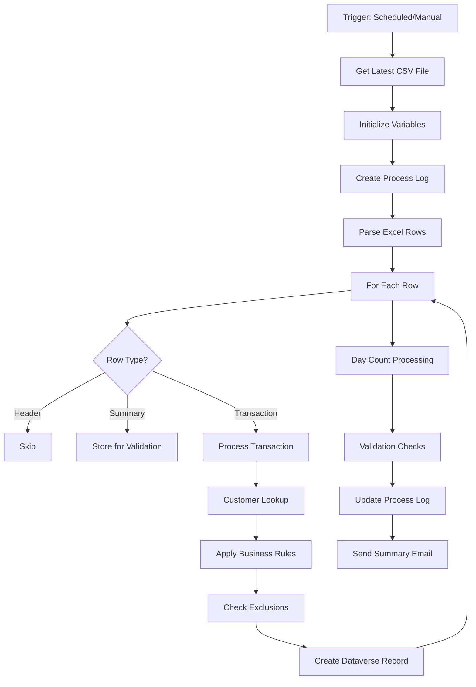

# Power Automate: SAP Daily Data Import Flow

## Flow Overview

**Flow Name**: `Daily SAP Transaction Import`
**Purpose**: Import daily SAP transaction data from Excel/CSV into Dataverse
**Trigger**: Scheduled (Daily 8:00 AM) + Manual
**Runtime**: ~5-10 minutes for 100 customers with 500-1000 transactions

---

## CSV File Structure

**Filename Pattern**: `Cash_Line_items_as of DD.MM.YYYY.csv`

**Columns** (10 total):
```
Account | Document Number | Assignment | Document Type | Document Date |
Net Due Date | Arrears by Net Due Date | Amount in Local Currency | Text | Reference
```

**Row Types**:
1. **Header Row** (Row 1): Column names
2. **Transaction Rows**: All fields populated, Document Number present
3. **Summary Rows**: Account + Amount only, Document Number empty (customer total)

**Sample Data**:
```csv
Account,Document Number,Assignment,Document Type,Document Date,Net Due Date,Arrears by Net Due Date,Amount in Local Currency,Text,Reference
198609,9974698958,9974698958,DG,9/26/2025,9/26/2025,3,"-30,213.31",,PR_GR09_406_ONNR
198609,,,,,,,"-73,618.74",,  ← Summary row
```

---

## Flow Architecture

### High-Level Steps



---

## Dataverse Table Names (CRITICAL)

⚠️ **Use actual production names, not documentation placeholders**:

| Documentation Name | Production Table Name |
|-------------------|----------------------|
| `nc_customers` | `cr7bb_customers` |
| `nc_transactions` | `cr7bb_transactions` |
| `nc_processlog` | `cr7bb_processlog` |
| `nc_emaillog` | `cr7bb_emaillog` |

**Field Prefix**: `cr7bb_` (see [FIELD_NAME_REFERENCE.md](FIELD_NAME_REFERENCE.md))

---

## Flow Variables

### Initialize at Start

```json
{
  "varProcessDate": "@{utcNow()}",
  "varBatchID": "@{formatDateTime(utcNow(), 'yyyyMMdd_HHmmss')}",
  "varFileName": "",
  "varRowCounter": 0,
  "varErrorCount": 0,
  "varTransactionCount": 0,
  "varCustomerList": [],
  "varSummaryAmounts": {},
  "varProcessLogID": "",
  "varErrorMessages": []
}
```

### Arrays for Processing

```json
{
  "arrCustomerSummaries": [],
  "arrValidationErrors": [],
  "arrExcludedTransactions": [],
  "arrProcessedCustomers": []
}
```

---

## Step-by-Step Implementation

### 1️⃣ **Trigger & File Detection**

#### Action: Recurrence
```yaml
Type: Recurrence
Frequency: Day
Time: 08:00 AM
Time Zone: SE Asia Standard Time
```

#### Action: Get files (properties only)
```yaml
Connector: SharePoint / OneDrive for Business
Site Address: [Your SharePoint Site]
Library: [Document Library Name]
Folder: /SAP Daily Exports
Filter Query:
  - File Name contains 'Cash_Line_items'
  - Modified >= @{addDays(utcNow(), -1)}
```

#### Action: Get file content
```yaml
File identifier: @{first(outputs('Get_files')?['body/value'])?['Id']}
Store result in: varFileContent
```

---

### 2️⃣ **Variable Initialization**

#### Initialize Batch ID
```javascript
formatDateTime(utcNow(), 'yyyyMMdd_HHmmss')
```

#### Initialize Process Date
```javascript
utcNow()
```

#### Initialize Counters
```javascript
// Row counter
0

// Error counter
0

// Transaction counter
0
```

---

### 3️⃣ **Create Process Log Entry**

#### Action: Add a new row (Dataverse)
```yaml
Table: cr7bb_processlogs
Fields:
  cr7bb_processdate: "@{formatDateTime(utcNow(), 'yyyy-MM-dd')}"
  cr7bb_starttime: "@{utcNow()}"
  cr7bb_status: "Running"
  cr7bb_sapfilename: "@{outputs('Get_file_content')?['Name']}"
  cr7bb_processedby: "@{workflow()?['tags']['xms-workflow-run-id']}"
  cr7bb_totalcustomers: 0
  cr7bb_emailssent: 0
  cr7bb_emailsfailed: 0
  cr7bb_transactionsprocessed: 0
  cr7bb_transactionsexcluded: 0
```

**Store Output**: `varProcessLogID = @{outputs('Add_process_log')?['cr7bb_processlogid']}`

---

### 4️⃣ **Parse CSV/Excel Rows**

⚠️ **Note**: Power Automate handles CSV differently than Excel. Choose appropriate connector:

#### Option A: Excel Online (Business) - If using .xlsx
```yaml
Action: List rows present in a table
File: @{outputs('Get_file_content')?['Id']}
Table: Table1
```

#### Option B: Parse CSV - If using .csv
```yaml
Action: Compose
Inputs: @{body('Get_file_content')}

Action: Select (Create CSV Object)
From: @{split(outputs('Compose'), decodeUriComponent('%0A'))}
Map: Parse each line manually
```

**Recommended**: Convert CSV to Excel Table format (.xlsx) in SharePoint for easier processing

---

### 5️⃣ **For Each Row - Main Processing Loop**

#### Action: Apply to each
```yaml
Select output from previous step: @{body('List_rows')?['value']}
```

#### Inside Loop: Increment Row Counter
```javascript
add(variables('varRowCounter'), 1)
```

#### Determine Record Type
```javascript
// Condition: Is this a header row?
if(equals(variables('varRowCounter'), 1), 'Header',
  // Is Document Number empty?
  if(empty(item()?['Document Number']), 'Summary', 'Transaction')
)
```

---

### 6️⃣ **Process Transaction Rows**

#### Condition: RecordType equals 'Transaction'

#### Action: Customer Lookup
```yaml
Action: List rows (Dataverse)
Table: cr7bb_customers
Filter Query: cr7bb_customercode eq '@{item()?['Account']}'
Row count: 1
```

#### Store Customer GUID
```javascript
outputs('List_customer')?['value']?[0]?['cr7bb_customerid']
```

#### Handle Customer Not Found
```yaml
Condition: length(outputs('List_customer')?['value']) equals 0
If True:
  - Append to varErrorMessages: "Customer @{item()?['Account']} not found"
  - Increment varErrorCount
  - Continue to next iteration
```

---

### 7️⃣ **Apply Business Rules**

#### Calculate Transaction Type
```javascript
// Based on Document Type mapping
switch(
  item()?['Document Type'],
  'DG', 'CN',  // Credit Note (negative amount)
  'DR', 'DN',  // Debit Note (positive amount)
  'DZ', 'CN',  // Direct Credit
  'Other'
)
```

#### Check Exclusion Keywords
```javascript
or(
  contains(toLower(item()?['Text']), 'paid'),
  contains(toLower(item()?['Text']), 'partial payment'),
  contains(toLower(item()?['Text']), 'exclude'),
  contains(item()?['Text'], 'รักษาตลาด'),
  contains(toLower(item()?['Text']), 'bill credit 30 days'),
  contains(toLower(item()?['Text']), 'ptp')  // Promise to Pay
)
```

#### Set Exclusion Flag
```javascript
// varIsExcluded
if(
  outputs('Check_exclusion')?['body'],
  true,
  false
)

// varExcludeReason
if(outputs('Check_exclusion')?['body'],
  'Exclusion keyword found in Text field',
  null
)
```

---

### 8️⃣ **Parse CSV Amounts & Dates**

#### Parse Amount (Handle Comma Separators)
```javascript
// CSV may have amounts like "-30,213.31" or "45155.04"
float(
  replace(
    replace(item()?['Amount in Local Currency'], ',', ''),
    '"', ''
  )
)
```

#### Parse Dates (M/D/YYYY format)
```javascript
// Document Date: "9/26/2025" → "2025-09-26"
formatDateTime(
  item()?['Document Date'],
  'yyyy-MM-dd'
)
```

#### Parse Arrears Days
```javascript
int(item()?['Arrears by Net Due Date'])
```

---

### 9️⃣ **Create Dataverse Transaction Record**

#### Action: Add a new row (Dataverse)
```yaml
Table: cr7bb_transactions
Fields:
  cr7bb_customer@odata.bind: "/cr7bb_customers(@{outputs('Customer_lookup')?['value']?[0]?['cr7bb_customerid']})"
  cr7bb_recordtype: "Transaction"
  cr7bb_documentnumber: "@{item()?['Document Number']}"
  cr7bb_assignment: "@{item()?['Assignment']}"
  cr7bb_documenttype: "@{item()?['Document Type']}"
  cr7bb_documentdate: "@{formatDateTime(item()?['Document Date'], 'yyyy-MM-dd')}"
  cr7bb_netduedate: "@{formatDateTime(item()?['Net Due Date'], 'yyyy-MM-dd')}"
  cr7bb_arrearsdays: "@{int(item()?['Arrears by Net Due Date'])}"
  cr7bb_amountlocalcurrency: "@{float(replace(replace(item()?['Amount in Local Currency'], ',', ''), '\"', ''))}"
  cr7bb_textfield: "@{item()?['Text']}"
  cr7bb_reference: "@{item()?['Reference']}"
  cr7bb_transactiontype: "@{outputs('Calculate_transaction_type')}"
  cr7bb_isexcluded: "@{outputs('Check_exclusion')?['body']}"
  cr7bb_excludereason: "@{if(outputs('Check_exclusion')?['body'], 'Keyword in Text field', null)}"
  cr7bb_daycount: "@{int(item()?['Arrears by Net Due Date'])}"
  cr7bb_processdate: "@{formatDateTime(variables('varProcessDate'), 'yyyy-MM-dd')}"
  cr7bb_processbatch: "@{variables('varBatchID')}"
  cr7bb_rownumber: "@{variables('varRowCounter')}"
  cr7bb_isprocessed: false
  cr7bb_emailsent: false
```

#### Error Handling
```yaml
Configure run after: has failed or has timed out
Action: Append to varErrorMessages
Value: "Row @{variables('varRowCounter')}: @{outputs('Add_transaction')?['error']?['message']}"
```

---

### 🔟 **Process Summary Rows**

#### Condition: RecordType equals 'Summary'

#### Action: Compose Summary Object
```javascript
{
  "customerCode": "@{item()?['Account']}",
  "summaryAmount": "@{float(replace(replace(item()?['Amount in Local Currency'], ',', ''), '\"', ''))}",
  "rowNumber": "@{variables('varRowCounter')}"
}
```

#### Action: Append to Array
```yaml
Array: varSummaryAmounts
Value: @{outputs('Compose_summary')}
```

---

### 1️⃣1️⃣ **Historical Day Count Processing**

**Run After**: Main loop completes

#### Action: Get Yesterday's Transactions
```yaml
Action: List rows (Dataverse)
Table: cr7bb_transactions
Filter Query: |
  cr7bb_processdate eq '@{formatDateTime(addDays(utcNow(), -1), 'yyyy-MM-dd')}'
  and cr7bb_recordtype eq 'Transaction'
```

#### Action: Apply to each (Today's Transactions)
```yaml
From: @{outputs('List_todays_transactions')?['value']}
```

#### Inside Loop: Find Yesterday's Match
```javascript
// Filter yesterday's transactions for same customer and document
first(
  filter(
    outputs('List_yesterdays_transactions')?['value'],
    and(
      equals(item()?['cr7bb_customer'], outputs('Current_transaction')?['cr7bb_customer']),
      equals(item()?['cr7bb_documentnumber'], outputs('Current_transaction')?['cr7bb_documentnumber'])
    )
  )
)
```

#### Update Day Count if Match Found
```yaml
Condition: Yesterday's match exists
If True:
  Action: Update a row (Dataverse)
  Table: cr7bb_transactions
  Row ID: @{outputs('Current_transaction')?['cr7bb_transactionid']}
  Fields:
    cr7bb_daycount: "@{add(outputs('Yesterday_match')?['cr7bb_daycount'], 1)}"
```

---

### 1️⃣2️⃣ **Validation Checks**

#### For Each Customer: Validate Summary Amounts

```javascript
// Get sum of transaction amounts for customer
sum(
  filter(
    outputs('List_todays_transactions')?['value'],
    equals(item()?['cr7bb_customer'], variables('varCurrentCustomerID'))
  ),
  'cr7bb_amountlocalcurrency'
)
```

#### Compare with Summary Row
```yaml
Condition: |
  abs(
    sub(
      variables('varCalculatedSum'),
      variables('varSummaryAmount')
    )
  ) gt 0.01  // Allow 1 cent rounding difference

If True:
  - Append to validation errors
  - Log warning (continue processing)
```

---

### 1️⃣3️⃣ **Update Process Log**

#### Action: Update a row (Dataverse)
```yaml
Table: cr7bb_processlogs
Row ID: @{variables('varProcessLogID')}
Fields:
  cr7bb_endtime: "@{utcNow()}"
  cr7bb_status: "@{if(greater(variables('varErrorCount'), 0), 'Completed with errors', 'Completed')}"
  cr7bb_totalcustomers: "@{length(variables('arrProcessedCustomers'))}"
  cr7bb_transactionsprocessed: "@{variables('varTransactionCount')}"
  cr7bb_transactionsexcluded: "@{length(variables('arrExcludedTransactions'))}"
  cr7bb_errormessages: "@{join(variables('varErrorMessages'), '; ')}"
```

---

### 1️⃣4️⃣ **Send Summary Email**

#### Condition: Errors > 0 OR Manual Trigger

#### Action: Send an email (V2)
```yaml
To: ar-team@nestle.com
Subject: "SAP Data Import - @{formatDateTime(utcNow(), 'yyyy-MM-dd')} - @{if(greater(variables('varErrorCount'), 0), '⚠️ Completed with Errors', '✅ Success')}"
Body: |
  <h2>SAP Daily Import Summary</h2>
  <p><strong>Process Date:</strong> @{formatDateTime(variables('varProcessDate'), 'dd/MM/yyyy HH:mm')}</p>
  <p><strong>Batch ID:</strong> @{variables('varBatchID')}</p>
  <p><strong>File:</strong> @{outputs('Get_file_content')?['Name']}</p>

  <h3>Statistics</h3>
  <ul>
    <li>Total Rows Processed: @{variables('varRowCounter')}</li>
    <li>Transactions Created: @{variables('varTransactionCount')}</li>
    <li>Customers Processed: @{length(variables('arrProcessedCustomers'))}</li>
    <li>Excluded Transactions: @{length(variables('arrExcludedTransactions'))}</li>
    <li>Errors: @{variables('varErrorCount')}</li>
  </ul>

  @{if(greater(variables('varErrorCount'), 0),
    concat('<h3>⚠️ Errors</h3><ul>',
      join(
        map(variables('varErrorMessages'), concat('<li>', item(), '</li>')),
        ''
      ),
      '</ul>'
    ),
    ''
  )}

  <p><a href="https://make.powerapps.com/environments/[ENV_ID]/solutions/[SOLUTION_ID]">View in Power Apps</a></p>
Importance: @{if(greater(variables('varErrorCount'), 0), 'High', 'Normal')}
```

---

## Power Automate Expressions Reference

### Date Formatting
```javascript
// Current date (yyyy-MM-dd)
formatDateTime(utcNow(), 'yyyy-MM-dd')

// Add/subtract days
addDays(utcNow(), -1)  // Yesterday
addDays(utcNow(), 1)   // Tomorrow

// Parse CSV date "9/26/2025" to ISO format
formatDateTime('9/26/2025', 'yyyy-MM-dd')
```

### Number Parsing
```javascript
// Parse CSV amount with comma separator
float(replace(replace('-30,213.31', ',', ''), '"', ''))  // Result: -30213.31

// Parse integer
int('3')  // Result: 3

// Absolute value
abs(-30213.31)  // Result: 30213.31
```

### String Operations
```javascript
// Check if empty
empty(item()?['Document Number'])

// Contains (case-sensitive)
contains(item()?['Text'], 'exclude')

// Contains (case-insensitive)
contains(toLower(item()?['Text']), 'paid')

// Replace
replace('30,213.31', ',', '')  // Result: "30213.31"

// Trim
trim('  text  ')
```

### Array Operations
```javascript
// Filter array
filter(outputs('List_rows')?['value'], equals(item()?['status'], 'active'))

// Map array
map(variables('arr'), item()?['name'])

// First item
first(outputs('List_rows')?['value'])

// Length
length(variables('arr'))

// Join array to string
join(variables('arrMessages'), '; ')

// Sum array property
sum(outputs('List_transactions')?['value'], 'amount')
```

### Conditional Logic
```javascript
// If-then-else
if(condition, valueIfTrue, valueIfFalse)

// Switch
switch(value, 'case1', 'result1', 'case2', 'result2', 'default')

// And/Or
and(condition1, condition2)
or(condition1, condition2)

// Not
not(condition)
```

### Dataverse Specific
```javascript
// OData lookup binding
"/cr7bb_customers(GUID-HERE)"

// Filter query
"cr7bb_customercode eq '198609'"
"cr7bb_processdate eq '2025-09-29'"
"cr7bb_amount gt 1000 and cr7bb_isexcluded eq false"
```

---

## Error Handling Strategy

### Scope: Try-Catch Pattern

```yaml
Scope: Try_Main_Processing
  - All main processing actions

Scope: Catch_Errors
  Configure run after: Try_Main_Processing has failed
  Actions:
    - Update process log with error status
    - Send error notification email
    - Terminate flow with Failed status
```

### Retry Policies

```yaml
Customer Lookup:
  Retry Policy:
    Type: Exponential
    Count: 3
    Interval: PT10S

Create Transaction Record:
  Retry Policy:
    Type: Fixed
    Count: 2
    Interval: PT5S
```

---

## Testing Procedure

### 1. Unit Testing (Single Customer)

```csv
Account,Document Number,Assignment,Document Type,Document Date,Net Due Date,Arrears by Net Due Date,Amount in Local Currency,Text,Reference
198609,9974698958,9974698958,DG,9/26/2025,9/26/2025,3,"-30,213.31",,PR_GR09_406_ONNR
198609,,,,,,,"-30,213.31",,
```

**Expected Result**:
- 1 transaction created
- 1 summary row stored
- Amounts match
- Process log shows 1 customer

### 2. Exclusion Testing

```csv
Account,Document Number,Assignment,Document Type,Document Date,Net Due Date,Arrears by Net Due Date,Amount in Local Currency,Text,Reference
198709,9974689838,9974689838,DG,9/22/2025,9/22/2025,7,"-63,561.19","Exclude จ่ายวันที่ 26/9/2025",PR_GR09_371_ONNR
```

**Expected Result**:
- Transaction created with `cr7bb_isexcluded = true`
- Exclude reason populated

### 3. Day Count Testing

**Day 1**: Import file with document 9974698958
**Expected**: `cr7bb_daycount = 3` (from Arrears field)

**Day 2**: Import same document again
**Expected**: `cr7bb_daycount = 4` (incremented)

### 4. Error Scenarios

Test with:
- Customer not found (invalid Account)
- Malformed dates
- Invalid amounts
- Missing required fields

**Expected**: Errors logged, processing continues for valid rows

---

## Performance Optimization

### Batch Processing
```yaml
For Each Loop:
  Concurrency Control: 1 (sequential processing)
  Reason: Maintain row order and accurate counters
```

### Customer Lookup Caching
```yaml
Before Loop:
  Action: List all customers
  Store in: varCustomerCache

In Loop:
  Filter cached list instead of Dataverse query
```

### Pagination
```yaml
List rows:
  Row count: 5000
  Include: $top=5000
```

---

## Deployment Checklist

- [ ] SharePoint/OneDrive folder configured
- [ ] Dataverse connection created with appropriate permissions
- [ ] Service account has write access to Dataverse tables
- [ ] Email notification recipients configured
- [ ] Test with sample CSV file
- [ ] Verify all field names use `cr7bb_` prefix
- [ ] Enable flow analytics and monitoring
- [ ] Set up error alerts
- [ ] Document flow URL for AR team

---

## Maintenance

### Daily Monitoring
- Check process log for failures
- Review excluded transaction count
- Validate summary amounts match

### Weekly Tasks
- Review error messages for patterns
- Check flow run history
- Verify day count increments correctly

### Monthly Tasks
- Archive old transaction data
- Review and optimize flow performance
- Update exclusion keyword list if needed

---

**Flow Status**: Ready for Implementation
**Last Updated**: September 30, 2025
**Owner**: AR Automation Team